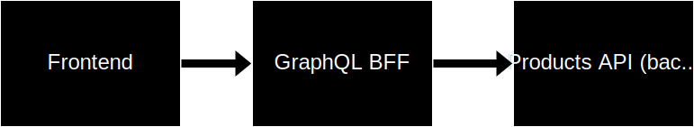

# GraphQL Contract Testing Using Specmatic

* [Specmatic Website](https://specmatic.in)
* [Specmatic Documenation](https://specmatic.in/documentation.html)

This sample project demonstrates how we can practice contract-driven development and contract testing in a GraphQL (Kotlin) API that depends on an external domain service. Here, Specmatic is used to stub calls to domain API service based on its OpenAPI specification.

### Architecture Diagram



### Starting the server

Run the following script on Linux:

```shell
chmod u+x gradlew
./gradlew bootRun
```

On Windows:

```commandline
gradlew bootRun
```

You'll need the backend product API server running for this to work. You can get it from [here](https://github.com/znsio/specmatic-order-api-java). The README.md file in the repo contain instructions for starting up the backend API server.

Visit http://localhost:8080/graphiql to access the GraphiQL interface.

### Running the contract tests

Use this command to run the contract tests:

- MacOS or Linux: `./gradlew test`
- Windows: `gradlew test`

The tests stub out the backend, so